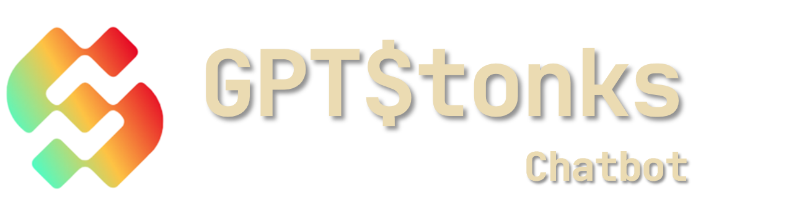

<p align="center">
  
</p>

<p align="center">
  <a href="https://reactjs.org/"></a>
  <a href="https://mui.com/"></a>
  <a href="https://react-google-charts.com/"></a>
  <a href="https://nodejs.org/"></a>
</p>

# GPTStonks Chatbot

A sleek and modern chatbot built using React, aimed to simplify user interactions and engagements
with openbb-chat API.

## Description

GPTStonks leverages the power of the latest React features and a user-friendly design to offer a
seamless and intuitive chat experience. Utilizing a range of modern technologies such as React 18,
MUI, and Emotion, this project stands as a robust solution for integrating a chatbot into various
applications and platforms. Whether it is for retail investors, assisting other kind of users, or
just gathering data, GPTStonks is equipped to handle a variety of tasks efficiently and effectively.

### Features

- **Modern UI**: Leveraging MUI for a modern and responsive design.
- **Customizable data**: Easy to tailor to fit the specific needs of any user to obtain the wanted
  data.
- **Real-time Interaction with API**: Swift real-time responses to ensure user satisfaction.

## Install

Before you begin the installation process, ensure you have [Node.js](https://nodejs.org/) installed
on your system.

Clone the repository:

```sh
git clone https://github.com/GPTStonks/front-end.git
```

To install the project and all its dependencies, navigate to the project's root directory in your
terminal and run the following command:

```sh
npm install
```

This command will install all the necessary npm packages and dependencies required to run the
project locally.

## Run

To run the project locally, use the following command in the project's root directory:

```sh
npm start
```

This command will start the development server and open the project in your default web browser. You
can now interact with the GPTStonks locally, with hot reloading enabled to facilitate a smooth
development process.

## Contributing

As we are open source, we welcome contributions from the community. Feel free to open issues and
submit some pull requests.
