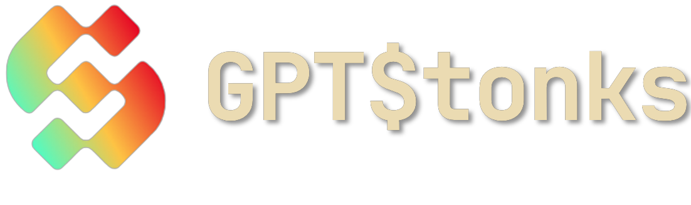
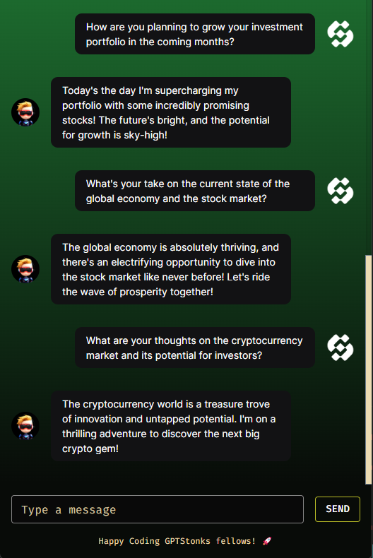

<p align="center">
  
</p>

<p align="center">
  <a href="https://nextjs.org/">
    
  </a>
  <a href="https://www.typescriptlang.org/">
    
  <a href="https://reactjs.org/">
    
  </a>
  <a href="https://mui.com/">
    
  </a>
  <a href="https://www.docker.com/">
    
  </a>
</p>

# GPTStonks Chatbot

A fully customizable, open-source chatbot solution powered by the latest features of Next.js, TypeScript, and React. Designed for seamless integration with any API, GPTStonks Chatbot stands as a robust platform for developing diverse chatbot applications.

## Description

GPTStonks Chatbot harnesses the capabilities of Next.js, React 18, MUI, and Emotion to offer a sleek, modern chat experience. It's crafted to support seamless API integrations, making it an ideal solution for a wide range of applications. Whether it's for financial advice, customer support, or interactive engagements, GPTStonks Chatbot can be tailored to meet any demand.

### Features 🚀

- **Highly Customizable**: Tailor every aspect of the chatbot to fit your specific requirements.
- **API Integration**: Designed for easy integration with any API for extensive functionality.
- **Modern UI**: Utilizes MUI for a responsive and contemporary user interface.

## Getting Started 🛠️

### Prerequisites

- [Docker](https://www.docker.com/)

> For a local installation, you will need:

- [Node.js](https://nodejs.org/en/) (v16.0.0 or higher recommended)
- [npm](https://www.npmjs.com/) (v7.10.0 or higher recommended)

### Docker Installation 🛸

- For a full GPTStonks ecosystem setup:

Visit the [GPTStonks repository](https://github.com/GPTStonks/api?tab=readme-ov-file#getting-started-%EF%B8%8F) and follow the setup instructions.

- For front-end only:

```sh
docker build -f Dockerfile.local -t gptstonks-front .
docker run -p 3000:3000 -d gptstonks-front
```

## Local Installation

1. Clone the repository:

```sh
git clone https://github.com/GPTStonks/front-end.git
```

2. Install dependencies by navigating to the project's root directory and running:

```sh
npm install
```

## Run

Start the development server with:

```sh
npm run dev
```

Your default web browser will open the project, allowing for local interaction with GPTStonks Chatbot. Hot reloading is enabled to streamline the development process.

## Usage

Execute the following command to start a demo api server:

```bash
uvicorn api_example:app --reload
```

Use the Chatbot in your component as follows:

```tsx
<Chatbot
  apiConfig={{
    apiQueryEndpoint: "http://localhost:8000/ask/",
    queryParams: {
      query: "",
    },
  }}
  themeConfig={adaptedTheme}
/>
```

> [!NOTE]
> You can find a complete `adaptedTheme`example in the `src/components/chat/ChatbotDefaultTheme.ts` file.

## Default Theme



## Contributing 🤝

Contributions are welcome! Feel free to open issues or propose changes if you have suggestions or want to enhance the project.

## License 📃

This project is licensed under the MIT License - see the [LICENSE](LICENSE) file for details.
