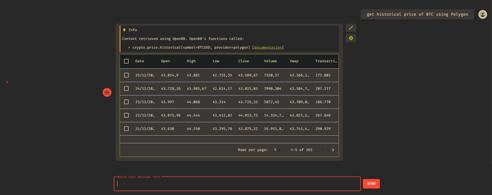
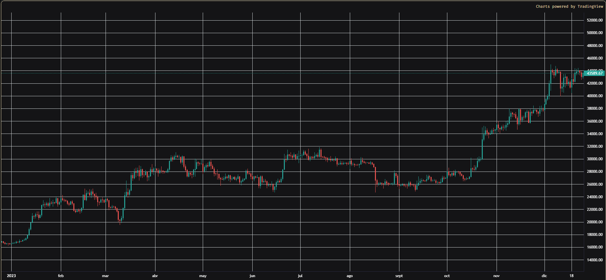

<p align="center">
  
</p>

<p align="center">
  <a href="https://reactjs.org/">
    
  </a>
  <a href="https://mui.com/">
    
  </a>
  <a href="https://mui.com/components/data-grid/">
    
  </a>
  <a href="https://nodejs.org/">
    
  </a>
  <a href="https://www.docker.com/">
    
  </a>
</p>

# GPTStonks Chatbot

A sleek and modern chatbot built using React, aimed to simplify user interactions and engagements
with openbb-chat API.

## Description

GPTStonks leverages the power of the latest React features and a user-friendly design to offer a
seamless and intuitive chat experience. Utilizing a range of modern technologies such as React 18,
MUI, and Emotion, this project stands as a robust solution for integrating a chatbot into various
applications and platforms. Whether it is for retail investors, assisting other kind of users, or
just gathering data, GPTStonks is equipped to handle a variety of tasks efficiently and effectively.

### Features 🚀

- **Modern UI**: Leveraging MUI for a modern and responsive design.
- **Customizable data**: Easy to tailor to fit the specific needs of any user to obtain the wanted
  data.
- **Real-time Interaction with API**: Swift real-time responses to ensure user satisfaction.

## Getting Started 🛠️

### Prerequisites

- [Docker](https://www.docker.com/)

> For local installation, you will need the following:

- [Node.js](https://nodejs.org/en/) (v19.0.0 or higher recommended)
- [npm](https://www.npmjs.com/) (v8.19.0 or higher recommended)

### Docker Installation 🛸

- Full gptstonks ecosystem installation:

Go to the [gptstonks](https://github.com/GPTStonks/api?tab=readme-ov-file#getting-started-%EF%B8%8F)
repository and follow the instructions.

- Only front-end installation:

```sh
docker build -f Dockerfile.local -t gptstonks-front .
docker run -p 3000:3000 -d gptstonks-front
```

## Local Installation

1. Clone the repository:

```sh
git clone https://github.com/GPTStonks/front-end.git
```

2. To install the project and all its dependencies, navigate to the project's root directory in your
   terminal and run the following command:

```sh
npm install
```

This command will install all the necessary npm packages and dependencies required to run the
project locally.

## Run

To run the project locally, use the following command in the project's root directory:

```sh
npm start
```

This command will start the development server and open the project in your default web browser. You
can now interact with the GPTStonks locally, with hot reloading enabled to facilitate a smooth
development process.

## Examples

### Chat View 💬



### Chart View 📈



## Contributing 🤝

We welcome contributions from the community! If you have any suggestions, bug reports, or want to
contribute to the project, feel free to open issues or propose changes.

## License 📃

This project is licensed under the MIT License - see the [LICENSE](LICENSE) file for details.
